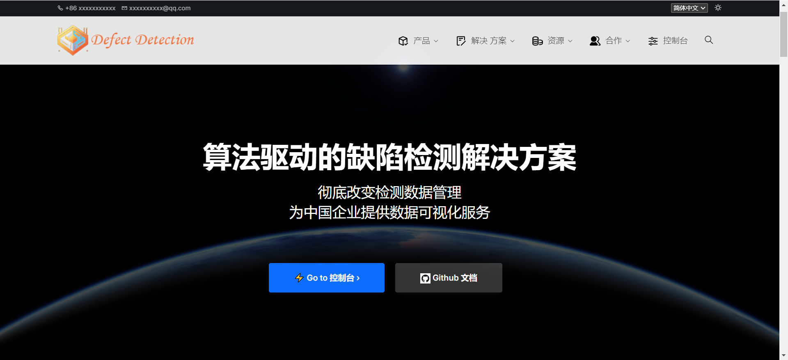

# defect-detection-system (Demo)

​	This code is for Intelligent Industrial Vision System for Defect Detection.

## Qualification

​	If you would like to adopt this project and then **redevelop** for yours, you are supposed to possess qualified skills by self-education or specialized courses. Here is a list of skills for consideration.

1. Competent to read development documents in English;
2. Command general knowledge about database and website;
3. Familiar with HTML5, CSS & JavaScript;
4. Expert at Python Web Tech (Django or Flask).

## References

​	The front-end templates are supported by CoreUI and Vvveb and based on BootstrapJS.

| Reference                  | Link                                                         |
| -------------------------- | ------------------------------------------------------------ |
| The Business Website       | [Github - Vvveb Bootstrap5 Template & UI Kit](https://github.com/givanz/landing) |
| The Dashboard              | [Github - CoreUI Free Bootstrap Admin Template](https://github.com/coreui/coreui-free-bootstrap-admin-template) <br />[CoreUI Development Document](https://coreui.io/bootstrap/docs/getting-started/) |
| Free Illustrations         | [Freepik](https://www.freepik.com/)                          |
| Online Translating Service | [translate.js](http://translate.zvo.cn/)                     |
| Data Visualization         | chart.js                                                     |

## Demonstration



## Dev

| Environment          | Content                                                      |
| -------------------- | ------------------------------------------------------------ |
| Front-End            | CoreUI(Bootstrap Template) v2.1.2                            |
| Back-End             | Django v4.1.12                                               |
| Database Deployment  | PostgreSQL(Docker)<br />Milvus Standalone in Docker(Seldom Used) |
| Browsers for testing | Chrome/Microsoft Edge                                        |
| IDE or Tools         | PyCharm CE<br />Chrome DevTools                              |

## Structure

```bash
├ ─ core						# models saved
│   ├ ─ core 					# Core components
│   │   ├ ─ settings.py			# Global settings
│   │   ├ ─ urls.py				# Global urls
│   │   └ ─ ...
│   ├ ─ detection				# App for dashboard
│   │   ├ ─ migrations*			# Generated by cmd
│   │   ├ ─ static*				# Generated by cmd
│   │   ├ ─ apps.py				# App info
│   │   ├ ─ urls.py				# Urls
│   │   ├ ─ views.py			# Views functions
│   │   ├ ─ models.py			# Associated with database
│   │   ├ ─ detecting.py		# Run detecting
│   │   └ ─ ...
│   ├ ─ home 					# App for business Website
│   │   └ ─ ...
│   ├ ─ templates				# Templates
│   │   ├ ─ detecting.py		# Run detecting
│   │   └ ─ ...
│   ├ ─ static					# Static files
│   ├ ─ staticfiles				# Useless, but do not delete
│   ├ ─ media					# Upload files
│   ├ ─ manage.py				# Project initiation
│   ├ ─ main.py					# Fast project initiation
│   ├ ─ uwsgi.ini				# Uwsgi configuration 
│   └ ─ __inin__.py
├── requirements.txt
└── README.md
```

## Configuration

- ###### Virtual Environment
  
  Use Python virtual environment or Conda environment.
  
  Note that Conda environment are not easily switched by windows commands. (I failed to do it.)
  
- ###### Pip Installation
  
  Install the **requirements.txt** for required Python library like Django or protobuf. 
  
  If you want to visit MySQL, please install pymysql or mysqlclient. If you would like use PostgreSQL, please install psycopg2.
  
- ###### Configure Database
  
  1. First, establish a database locally or remotely. (Recommend pirated **Navicat** for management and Docker for deployment.)
  2. Edit "detection/**models.py**" for **ORM**(Object-Relational Mapping).
  3. Run `python manage.py makemigrations` to record the changes locally in "core/detection/migrations".
  4. Run `python manage.py migrate` to commit changes into your database.
  5. Reset **DATABASES** in **settings.py**.
  6. Run and debug.
  
- ###### Configure Static Files

  It's a very complicated work actually, but almost everything has been done.

  1. After set **DEBUG=False**, please run the command: 

     `python manage.py collectstatic`

  2. Debug for any possible bugs.

- ###### Configure Image Storage
  
  1. Reset **MEDIA_URL** and **MEDIA_ROOT**. Determine the storage path for uploaded images.
  2. Debug for any possible bugs.
  
- ###### Edit Templates

  1. Reset **TEMPLATES** in settings.py for any changes.
  2. All web pages in "core/templates/" are inherited from the skeleton templates and based on **Django template language**. 
  3. Check it for more information: [Django-Template-en](https://docs.djangoproject.com/en/4.2/ref/templates/language/) or [Django-Template-zh](https://docs.djangoproject.com/zh-hans/4.2/ref/templates/language/)

## Detection

​	Please take it as reference: [STFPM_AnomalyDetection](https://github.com/InkyZigi/STFPM_AnomalyDetection)

## Deployment on Linux

1. activate the python env

   ```bash
   $ cd home/environment/web/bin
   $ source activate
   ```

2. start uwsgi

   ```bash
   $ cd /home/project_XXX
   $ uwsgi --ini uwsgi.ini
   ```

   

3. restart nginx

   ```bash
   $ nginx -s reload
   ```

   

4. test for web

```bash
$ curl 0.0.0.0:80
```


## Weakness

- ###### Imperfect Modules

  Generally, the dashboard system is divided into four modules: Production, Model, Data and Report. 

  - For the production module, the program on the full process of management and approval of working sheets has **not yet completed**.
  - For the model module, the Backlog includes two aspects, one is to **expand the additional models** for detection, the other is to Invoke the model prediction programs from the outside with different virtual environments or remote API. 
  - For the data module and the report module,  the data retrieval service and report conclusion service is **not well-prepared**. 

- ###### Unorganized Views Functions

  When a user visit a specific URL, the corresponding views function with be executed to render the page. However, the realization code is so confusing to understand or maintain that **code refactoring** is required. For example, some back-end computing processing is mixed with template rendering in one view function, which can be separated.

- ###### API for Image Processing

  This part is on the Model module. Check it in the **model** function in "/detection/views.py".

  - The API in the code is not specific to image processing. **An independent API** is needed here. 
  - Temporarily, the prediction program support batch work, but the API is able to process one image at a time.

- ###### Detecting Data Management

  Detecting Data should be further recorded and managed in way of RMDB or Milvus. Detecting data means the information of operations In RMDB, while it also means the feature vectors of the prediction in Milvus.

- ###### Model Validating and Testing

  This code is lack of validation set. 

  The test set comes from the MVTec Dataset merely containing standard images. Although we practised some field test on embedded end (controlling a robotic arm to classify objects), the real-time test data was not recorded.